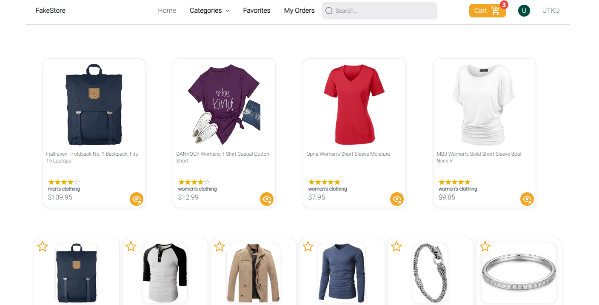

 

# E-CommerceDemo

E-CommerceDemo is an e-commerce demo where users can browse various products, add them to their cart, and place orders. Local storage is used for some operations in the project. It is live on Vercel: [E-CommerceDemo Live](https://e-commerce-demo-ochre.vercel.app).

[Video presentation](https://www.youtube.com/watch?v=b7ggSHUDF1M) .


## Features

- [x] Responsive design
- [x] User login and registration
- [x] Product search and filtering
- [x] View product details
- [x] User favorite management
- [x] User cart management
- [x] Place product orders
- [x] Order payment management
- [x] View order history
- [x] Order detail PDF export
- [x] Order detail Email
- [ ] User reviews
- [ ] Add products

## Technologies

<div>

  <a href="https://fakestoreapi.com">
    
  </a>
  <a href="https://reactjs.org">
    
  </a>
  <a href="https://react-icons.github.io/react-icons/">
    
  </a>
  <a href="https://react-pdf.org/">
    
  </a>
  <a href="https://redux.js.org">
    
  </a>
  <a href="https://clerk.com/">
    
  </a>
  <a href="https://tailwindcss.com/">
    
  </a>
    <a href="https://nextjs.org">
    
  </a>
  <a href="https://nextui.org">
    
  </a>
  <a href="https://www.radix-ui.com/">
    
  </a>
  <a href="https://www.typescriptlang.org">
    
  </a>
  <a href="https://stripe.com">
    
  </a>
</div>

##### React: 18 & Next: 14.2.3

- For other versions, see the [package.json](https://github.com/Utkucuu/E-CommerceDemo/blob/master/package.json) file.

###### Payment processing [Stripe API](https://stripe.com/)

###### State management [Redux](https://redux-toolkit.js.org/)

###### Products [Fake Store API](https://fakestoreapi.com/)

###### Authentication [Clerk](https://clerk.com/)

### Adım Adım Kurulum

### Requirements

- Node.js
- npm veya yarn
- Git

1. Clone the project files and install the necessary dependencies.

   ```bash
   git clone https://github.com/Utkucuu/E-CommerceDemo
   cd E-CommerceDemo
   npm install
   ```

2. Set up the environment variables. Create a `.env` file and add the necessary keys.

   ```
   NEXT_PUBLIC_CLERK_PUBLISHABLE_KEY=<YOUR_PUBLİSHABLE_KEY>
   CLERK_SECRET_KEY=<YOUR_SECRET_KEY>
   NEXT_PUBLIC_CLERK_SIGN_IN_URL=/sign-in
   NEXT_PUBLIC_CLERK_SIGN_UP_URL=/sign-up
   API_URL=<https://fakestoreapi.com/>
   STRIPE_SECRET_KEY=<YOUR_SECRET_KEY>
   NEXT_PUBLIC_STRIPE_API_KEY=<YOUR_STRIPE_API_KEY>
   ```

3. Run the project on the local server.

   ```bash
   npm run dev
   ```

4. Open your browser and go to `http://localhost:3000` to start using the application.

### Structor

- To examine the directory structure, see the [directoryStructor](https://github.com/Utkucuu/E-CommerceDemo/blob/master/directoryStructor.txt) file.

### License

This project is licensed under the MIT License. For more information, see the [License](https://github.com/Utkucuu/E-CommerceDemo/blob/master/LICENSE) file.
